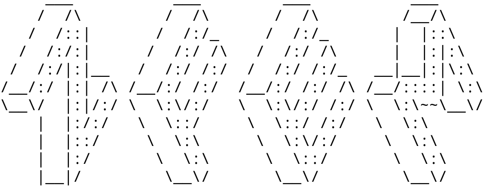
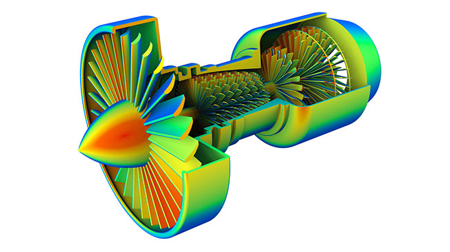
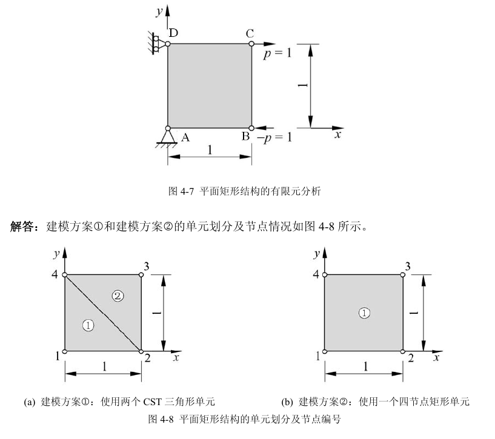

<!-- https://github.com/hunter1992/zhmfem -->
<a id="readme-top"></a>

# zhmfem

A finite element calculation command line software based on Rust

<!-- PROJECT SHIELDS -->
<!--
*** I'm using markdown "reference style" links for readability.
*** Reference links are enclosed in brackets [ ] instead of parentheses ( ).
*** See the bottom of this document for the declaration of the reference variables
*** for contributors-url, forks-url, etc. This is an optional, concise syntax you may use.
*** https://www.markdownguide.org/basic-syntax/#reference-style-links
-->
[![Contributors][contributors-shield]][contributors-url]
[![Forks][forks-shield]][forks-url]
[![Stargazers][stars-shield]][stars-url]
[![Issues][issues-shield]][issues-url]
[![Unlicense License][license-shield]][license-url]
[![LinkedIn][linkedin-shield]][linkedin-url]


<!-- PROJECT LOGO -->
<br />
<div align="center">
  <a href="https://github.com/hunter1992/zhmfem">
    

  </a>

<h3 align="center">ZFEM</h3>

  <p align="center">
    A finite element calculation command line software based on Rust
    <br />
    <a href="https://github.com/hunter1992/zhmfem"><strong>Explore the docs »</strong></a>
    <br />
    <br />
    <a href="https://github.com/hunter1992/zhmfem?tab=readme-ov-file#example">View Demo</a>
    ·
    <a href="https://github.com/hunter1992/zhmfem/issues/new?labels=bug&template=bug-report---.md">Report Bug</a>
    ·
    <a href="https://github.com/hunter1992/zhmfem/issues/new?labels=enhancement&template=feature-request---.md">Request Feature</a>
  </p>
</div>


<!-- TABLE OF CONTENTS -->
<details>
  <summary>Table of Contents</summary>
  <ol>
    <li>
      <a href="#about-the-project">About The Project</a>
      <ul>
        <li><a href="#built-with">Built With</a></li>
      </ul>
    </li>
    <li>
      <a href="#getting-started">Getting Started</a>
      <ul>
        <li><a href="#prerequisites">Prerequisites</a></li>
        <li><a href="#installation">Installation</a></li>
      </ul>
    </li>
    <li><a href="#example">Example</a></li>
    <li><a href="#roadmap">Roadmap</a></li>
    <li><a href="#contributing">Contributing</a></li>
    <li><a href="#license">License</a></li>
    <li><a href="#contact">Contact</a></li>
    <li><a href="#acknowledgments">Acknowledgments</a></li>
  </ol>
</details>


<!-- ABOUT THE PROJECT -->
## About The Project



After studying the theory and application of finite element technology for several years, 
hunter1992 started this open source project out of interest when he graduated with his doctorate.

The answers to several basic questions related to this project are as follows:
* Why Rust? -- Performance, Reliability and Productivity.
* Pre/Post-Processing Module? -- The current development plan of zhmfem does not 
  include pre-/post-processing modules. Pre-processing can be achieved by providing 
  node data; post-processing can be achieved in ParaView after outputting .vtk files.


The zhmfem project is in the early stages of development, and all parts are not yet completely stable. 
Users are welcome to make suggestions, and the author will accept them after careful consideration.

<p align="right">
(<a href="#readme-top">back to top</a>)</p>


### Built With

* [![Rust][Rustc]][Rust-url]
<p align="right">(<a href="#readme-top">back to top</a>)</p>

<!-- GETTING STARTED -->
## Getting Started

### Prerequisites

#### 1. operating system
The operating system used by the author to develop zhmfem is Manjaro Linux. 
Since zhmfem is currently in the early stage of core function development, 
it has **not** been adapted to MacOS and Windows systems. As of December 2024, 
the operating system information used by the author is as follows:
```
 ██████████████████  ████████     zhm@zhm
 ██████████████████  ████████     OS: Manjaro 24.2.0 Yonada
 ██████████████████  ████████     Kernel: x86_64 Linux 6.1.119-1-MANJARO
 ██████████████████  ████████     Uptime: 12h 4m
 ████████            ████████     Packages: 1599
 ████████  ████████  ████████     Shell: zsh 5.9
 ████████  ████████  ████████     Resolution: 2560x1440
 ████████  ████████  ████████     DE: KDE
 ████████  ████████  ████████     WM: KWin
 ████████  ████████  ████████     GTK Theme: Breath [GTK2/3]
 ████████  ████████  ████████     Icon Theme: breeze
 ████████  ████████  ████████     Disk: 185G / 325G (61%)
 ████████  ████████  ████████     CPU: Intel Core i5-8265U @ 8x 3.9GHz [44.0°C]
 ████████  ████████  ████████     GPU: NVIDIA GeForce MX250
                                  RAM: 3456MiB / 7699MiB
```

#### 2. Rust version

zhmfem is developed in the nightly version of Rust. The Rust version used by the author is as follows:
```
rustc 1.85.0-nightly (7db7489f9 2024-11-25)
binary: rustc
commit-date: 2024-11-25
host: x86_64-unknown-linux-gnu
release: 1.85.0-nightly
LLVM version: 19.1.4
```

### Installation

_install and using steps:_

1. Install Rust on your operating system, [install Rust now](https://www.rust-lang.org/tools/install)
2. Clone the repo
   ```
   git clone https://github.com/hunter1992/zhmfem.git
   ```
3. Check out the examples under 'zhmfem/examples/' path using:
   ```
   cargo run --examples <example-name>
   ```
   Or you can compile and run the examples more quickly using the following command:
   ```
   cargo run -j 8 --release --example <example-name>
   ```

<p align="right">(<a href="#readme-top">back to top</a>)</p>


<!-- USAGE EXAMPLES -->
## Example

The usage process of zhmfem is briefly introduced with the example of 
solving plane stress problems with CST element (linear triangular element).

This question comes from _[Fundamentals of Finite Element Analysis](http://www.caemotion.com/pdf/Fundamentals%20of%20Finite%20Element%20Analysis.pdf)_
(Page105) written by _Zeng Pan_. (in Chinese: [曾攀](https://zh.wikipedia.org/wiki/%E6%9B%BE%E6%94%80)(清华大学)
《有限元基础教程》北京：高等教育出版社，2009.7（2012.11重印）).
_If you are interested in learning FEM, 
here is a great [lessen](https://www.bilibili.com/video/BV1iP4y1y7qh/?spm_id_from=333.337.search-card.all.click) by Prof. Zeng Pan_

For the plane stress problem shown in the Figure 4-7 below，the material parameters are:
E = 1 (Young's modulus), $\nu$ = 0.25 (Poisson's ratio), and the thickness is $1$. 

+ The displacement boundary conditions are: 

  $$u_A=0,\quad v_A=0,\quad u_D=0$$

+ The external load conditions are: 
  
  $$p_{Bx}=-1,\quad p_{By}=0,\quad p_{Cx}=1,\quad p_{Cy}=0,\quad p_{Dy}=0$$


Try to calculate the displacement field, strain field, stress field, 
support reaction force at each node, strain energy of the system, 
external work, and total potential energy of the system under the following two modeling situations. 
And compare the calculation accuracy of two modeling scheme.

The two modeling schemes are shown in Figure 4-8.
As shown in Figure 4-8(a), two constant strain triangle elements are used, 
and one four-node rectangular element is used in Figure 4-8(b).



### Solution

1. **programming the problem**

   Under zhmfem/example path, the _tri2d3n.rs_ file uses comments to explain in detail 
how to build a model for the problem to be solved, how to apply boundary conditions 
and external loads, how to calculate, and how to display and export calculation results.
    ```
    #![allow(incomplete_features)]
    #![feature(generic_const_exprs)]
    
    use std::time::Instant;
    
    use zhmfem::*;
    
    fn main() {
        // set timing start
        let time_start = Instant::now();
    
        // -------- Part 1:  Set initial parameters --------
        let thick: Dtype = 1.0; //Thickness of the plate
        let material: (Dtype, Dtype) = (1.0, 0.25); //Young's modulud & Poisson's ratio
    
        // Set mesh and freedom parameters
        const R: usize = 2; // rows of nodes
        const C: usize = 2; // columns of nodes
        const M: usize = 3; // num of nodes in single element
        const F: usize = 2; // num of degree freedom at single node
    
        //Controls the style of printing numbers in scientific notation
        const E: Dtype = 0.0;
    
        // Manually set coords and grouped nodes index
        let points: Vec<Vec<Dtype>> = vec![
            vec![0.0, 0.0],
            vec![1.0, 0.0],
            vec![1.0, 1.0],
            vec![0.0, 1.0],
        ];
        let grpdnidx: Vec<Vec<usize>> = vec![vec![0, 1, 3], vec![2, 3, 1]];
    
        /*
        // Auto-mesh generate coords and grouped nodes index
        const W: Dtype = 1.0; // width
        const H: Dtype = 1.0; // height
        let solid1 = Rectangle::new([0.0 as Dtype, 0.0 as Dtype], [W, H]);
        let (points, grpdnidx) = solid1.mesh_with_tri2d3n(R, C);
        */
    
        // Set boundary conditions and external loads
        let zero_disp_index: Vec<usize> = vec![0, 1, 6];
        let force_index: Vec<usize> = vec![2, 4];
        let force_value: Vec<Dtype> = vec![-1.0, 1.0];
        let force_data: HashMap<usize, Dtype> = force_index
            .into_iter()
            .zip(force_value.into_iter())
            .collect();
    
        // -------- Part 2:  Construct nodes, elements and parts --------
        // Construct 2D nodes vector
        let nodes = nodes2d_vec(&points, &force_data);
    
        // Construct Tri2D3N elements vector
        let mut triangles = tri2d3n_vec(thick, &nodes, &grpdnidx, &material);
        let element_type: &str = "Tri2D3N_";
    
        // Construct 2D part & assembly global stiffness matrix
        let mut part: Part2D<'_, Tri2D3N<'_>, { R * C }, F, M> =
            Part2D::new(1, &nodes, &mut triangles, &grpdnidx);
        part.k_printer(E);
    
        // -------- Part 3:  Solve the problem --------
        // construct solver and solve the case
        let mut eqs: LinearEqs<{ R * C * F }> = LinearEqs::new(
            part.nodes_displacement(),
            part.nodes_force(),
            zero_disp_index,
            *part.k(),
        );
    
        // 1) solve the linear equations of static system using direct method.
        eqs.lu_direct_solver(); //LU decomposition method
        let output_file = "LU.txt";
    
        // 2) solve the linear equations of static system using iter method.
        //eqs.gauss_seidel_iter_solver(0.001);
        //let output_file = "G-S.txt";
    
        // 3) or you can solve the problem with a more concise call:
        // eqs.solve("lu", 0.001); // or eqs.solve("gs", 0.001);
    
        let calc_time: std::time::Duration = eqs.solver_calc_time.unwrap();
    
        // write the displacement and force result into Node2D's field
        part.write_result(&eqs);
    
        // -------- Part 4:  Print all kinds of result --------
        print_1darr("qe", &part.nodes_displacement(), E);
        print_1darr("fe", &part.nodes_force(), E);
    
        println!("\n>>> System energy:");
        let strain_energy: Dtype = strain_energy(*part.k(), part.nodes_displacement());
        let external_force_work: Dtype =
            external_force_work(part.nodes_force(), part.nodes_displacement());
        let potential_energy: Dtype =
            potential_energy(*part.k(), part.nodes_force(), part.nodes_displacement());
        println!("\tE_d: {:-9.6} (deform energy)", strain_energy);
        println!("\tW_f: {:-9.6} (exforce works)", external_force_work);
        println!("\tE_p: {:-9.6} (potential energy)", potential_energy);
    
        for elem in part.elems.iter() {
            elem.k_printer(E);
            elem.print_strain();
            elem.print_stress();
        }
    
        // -------- Part 5:  Write clac result into txt file --------
        let output_path = "/home/zhm/Documents/Scripts/Rust/zhmfem/results/";
        let output = format!("{output_path}{element_type}{output_file}");
        part.txt_writer(
            &output,
            calc_time,
            E,
            (strain_energy, external_force_work, potential_energy),
        )
        .expect(">>> !!! Failed to output text result file !!!");
    
        let total_time = time_start.elapsed();
        println!("\n>>> Total time consuming: {:?}", total_time);
    }
    ```

2. **Build & Run**

   Open Shell in the zhmfem root directory and use the following command
   to compile and run the tri2d3n.rs file:
   ```
   cargo run -j 8 --release --example tri2d3n
   ```

3. **Check the results**

   The calculation result displayed in the shell is

   ```
    >>> Assembling Part2D(#1)'s global stiffness matrix K1 ......
    
    >>> Calculating Tri2D3N(#0)'s local stiffness matrix k0 ......
    
    >>> Calculating Tri2D3N(#1)'s local stiffness matrix k1 ......
    
    Part #1  K =  (* 10^0)
    [[     0.733333      0.333333     -0.533333     -0.200000      0.000000      0.000000     -0.200000     -0.133333 ]
     [     0.333333      0.733333     -0.133333     -0.200000      0.000000      0.000000     -0.200000     -0.533333 ]
     [    -0.533333     -0.133333      0.733333      0.000000     -0.200000     -0.200000      0.000000      0.333333 ]
     [    -0.200000     -0.200000      0.000000      0.733333     -0.133333     -0.533333      0.333333      0.000000 ]
     [     0.000000      0.000000     -0.200000     -0.133333      0.733333      0.333333     -0.533333     -0.200000 ]
     [     0.000000      0.000000     -0.200000     -0.533333      0.333333      0.733333     -0.133333     -0.200000 ]
     [    -0.200000     -0.200000      0.000000      0.333333     -0.533333     -0.133333      0.733333      0.000000 ]
     [    -0.133333     -0.533333      0.333333      0.000000     -0.200000     -0.200000      0.000000      0.733333 ]]
    
    
    >>> LU decomposition method down!
    time consuming = 4.356µs
    
    qe = (10^0 *)
     [[      0.000000       0.000000      -1.718750      -0.937500       1.718750      -1.718750       0.000000       0.781250 ]]
    
    
    fe = (10^0 *)
     [[      1.000000       0.000000      -1.000000       0.000000       1.000000      -0.000000      -1.000000       0.000000 ]]
    
    
    >>> System energy:
    E_d:  1.718750 (deform energy)
    W_f:  3.437500 (exforce works)
    E_p: -1.718750 (potential energy)
    
    Tri2D3N k0 =  (* 10^0)
    [[     0.733333      0.333333     -0.533333     -0.200000     -0.200000     -0.133333 ]
     [     0.333333      0.733333     -0.133333     -0.200000     -0.200000     -0.533333 ]
     [    -0.533333     -0.133333      0.533333      0.000000      0.000000      0.133333 ]
     [    -0.200000     -0.200000      0.000000      0.200000      0.200000      0.000000 ]
     [    -0.200000     -0.200000      0.000000      0.200000      0.200000      0.000000 ]
     [    -0.133333     -0.533333      0.133333      0.000000      0.000000      0.533333 ]]
    
    
    elem[0] strain:
    E_xx =        -1.718750
    E_yy =         0.781250
    E_xy =        -0.937500
    
    elem[0] stress:
    S_xx =        -1.625000
    S_yy =         0.375000
    S_xy =        -0.375000
    
    Tri2D3N k1 =  (* 10^0)
    [[     0.733333      0.333333     -0.533333     -0.200000     -0.200000     -0.133333 ]
     [     0.333333      0.733333     -0.133333     -0.200000     -0.200000     -0.533333 ]
     [    -0.533333     -0.133333      0.533333      0.000000      0.000000      0.133333 ]
     [    -0.200000     -0.200000     -0.000000      0.200000      0.200000     -0.000000 ]
     [    -0.200000     -0.200000     -0.000000      0.200000      0.200000     -0.000000 ]
     [    -0.133333     -0.533333      0.133333      0.000000      0.000000      0.533333 ]]
    
    
    elem[1] strain:
    E_xx =         1.718750
    E_yy =        -0.781250
    E_xy =         0.937500
    
    elem[1] stress:
    S_xx =         1.625000
    S_yy =        -0.375000
    S_xy =         0.375000
    
    >>> Writing calc results into txt file ......
    Down!
    
    >>> Total time consuming: 1.537479ms
   ```

The calculation results of zhmfem are exactly the same as those in the book.

There are many [examples](https://github.com/hunter1992/zhmfem/tree/main/examples) under 
zhmfem/exampls path.
These examples use various elements to solve different types of finite
element problems and display the calculation results (including displaying
the results on the command line or outputting them into .txt files for human reading
or .vtk files for ParaView display). For more examples, please refer to the 
_[examples](https://github.com/hunter1992/zhmfem/tree/main/examples)_.

<p align="right">(<a href="#readme-top">back to top</a>)</p>


<!-- ROADMAP -->
## Roadmap

- [ ] Add output .vtk file
- [ ] Add non-linear rod element
- [ ] Add Tri2D6N elements
- [ ] Add document
- [ ] Add non-linear FEM
    - [ ] plastic
    - [ ] geo-nonlinear

See the [open issues](https://github.com/hunter1992/zhmfem/issues) for a full list of proposed features (and known issues).

<p align="right">(<a href="#readme-top">back to top</a>)</p>


<!-- CONTRIBUTING -->
## Contributing

If you have a suggestion that would make this better, please fork the repo and create a pull request. 
You can also simply open an issue with the tag "enhancement".
Don't forget to give the project a star! Thanks again!

1. Fork the Project
2. Create your Feature Branch (`git checkout -b feature/AmazingFeature`)
3. Commit your Changes (`git commit -m 'Add some AmazingFeature'`)
4. Push to the Branch (`git push origin feature/AmazingFeature`)
5. Open a Pull Request

### Top contributors:

<a href="https://github.com/othneildrew/Best-README-Template/graphs/contributors">
  
</a>

<p align="right">(<a href="#readme-top">back to top</a>)</p>


<!-- LICENSE -->
## License

Distributed under the GPL License. See `[LICENSE](https://github.com/hunter1992/zhmfem/blob/main/LICENSE)` for more information.

<p align="right">(<a href="#readme-top">back to top</a>)</p>


<!-- CONTACT -->
## Contact

张洪铭 - [Zhang Hongming](https://github.com/hunter1992) - 1101510340zhm@gmail.com


<p align="right">(<a href="#readme-top">back to top</a>)</p>


<!-- ACKNOWLEDGMENTS -->
## Acknowledgments

* [追忆曾攀教授](https://www.tsinghua.org.cn/info/1951/37828.htm)
* [Choose an Open Source License](https://choosealicense.com)
* [GitHub Emoji Cheat Sheet](https://www.webpagefx.com/tools/emoji-cheat-sheet)
* [Malven's Flexbox Cheatsheet](https://flexbox.malven.co/)
* [Malven's Grid Cheatsheet](https://grid.malven.co/)
* [Img Shields](https://shields.io)
* [GitHub Pages](https://pages.github.com)
* [Font Awesome](https://fontawesome.com)
* [React Icons](https://react-icons.github.io/react-icons/search)

<p align="right">(<a href="#readme-top">back to top</a>)</p>


<!-- MARKDOWN LINKS & IMAGES -->
<!-- https://github.com/hunter1992/zhmfem -->
[contributors-shield]: https://img.shields.io/github/contributors/hunter1992/zhmfem.svg?style=for-the-badge
[contributors-url]: https://githubf.com/hunter1992/zhmfem/graphs/contributors
[forks-shield]: https://img.shields.io/github/forks/hunter1992/zhmfem.svg?style=for-the-badge
[forks-url]: https://github.com/hunter1992/zhmfem/network/members
[stars-shield]: https://img.shields.io/github/stars/hunter1992/zhmfem.svg?style=for-the-badge
[stars-url]: https://github.com/hunter1992/zhmfem/stargazers
[issues-shield]: https://img.shields.io/github/issues/hunter1992/zhmfem.svg?style=for-the-badge
[issues-url]: https://github.com/hunter1992/zhmfem/issues
[license-shield]: https://img.shields.io/github/license/hunter1992/zhmfem.svg?style=for-the-badge
[license-url]: https://github.com/hunter1992/zhmfem/blob/master/LICENSE.txt
[linkedin-shield]: https://img.shields.io/badge/-LinkedIn-black.svg?style=for-the-badge&logo=linkedin&colorB=555
[linkedin-url]: https://github.com/hunter1992
[product-screenshot]: images/screenshot.png
[Rustc]: https://img.shields.io/badge/Rust-000000?style=flat&logo=rust&logoColor=white
[Rust-url]: https://www.rust-lang.org/
