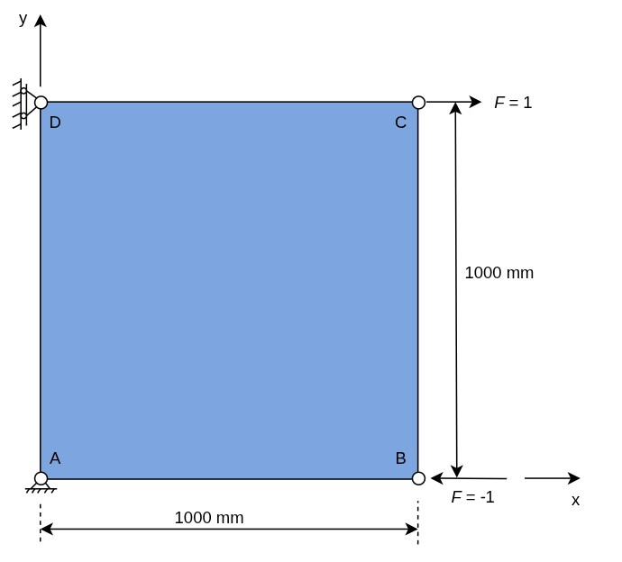
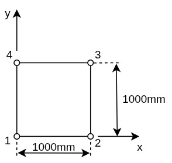

<!-- https://github.com/hunter1992/zhmfem -->
<a id="readme-top"></a>

# zhmfem

A finite element calculation command line software based on Rust

<!-- PROJECT SHIELDS -->
<!--
*** I'm using markdown "reference style" links for readability.
*** Reference links are enclosed in brackets [ ] instead of parentheses ( ).
*** See the bottom of this document for the declaration of the reference variables
*** for contributors-url, forks-url, etc. This is an optional, concise syntax you may use.
*** https://www.markdownguide.org/basic-syntax/#reference-style-links
-->
[![Contributors][contributors-shield]][contributors-url]
[![Forks][forks-shield]][forks-url]
[![Stargazers][stars-shield]][stars-url]
[![Issues][issues-shield]][issues-url]
[![Unlicense License][license-shield]][license-url]
[![Author][linkedin-shield]][linkedin-url]


<!-- PROJECT LOGO -->
<br />
<div>
  <a href="https://github.com/hunter1992/zhmfem">
    
  </a>

<h3 align="center">ZFEM</h3>

  <p align="center">
    A lightweight, fast finite element calculation software based on Rust
    <br />
    <a href="https://github.com/hunter1992/zhmfem"><strong>Explore the docs »</strong></a>
    <br />
    <br />
    <a href="https://github.com/hunter1992/zhmfem?tab=readme-ov-file#example">View Demo</a>
    ·
    <a href="https://github.com/hunter1992/zhmfem/issues/new?labels=bug&template=bug-report---.md">Report Bug</a>
    ·
    <a href="https://github.com/hunter1992/zhmfem/issues/new?labels=enhancement&template=feature-request---.md">Request Feature</a>
  </p>
</div>


<!-- TABLE OF CONTENTS -->
<details>
  <summary>Table of Contents</summary>
  <ol>
    <li>
      <a href="#about-the-project">About The Project</a>
      <ul>
        <li><a href="#built-with">Built With</a></li>
      </ul>
    </li>
    <li>
      <a href="#getting-started">Getting Started</a>
      <ul>
        <li><a href="#prerequisites">Prerequisites</a></li>
        <li><a href="#installation-and-use">Installation and use</a></li>
      </ul>
    </li>
    <li><a href="#tutorial">Tutorial</a></li>
    <li><a href="#roadmap">Roadmap</a></li>
    <li><a href="#contributing">Contributing</a></li>
    <li><a href="#license">License</a></li>
    <li><a href="#contact">Contact</a></li>
    <li><a href="#acknowledgments">Acknowledgments</a></li>
  </ol>
</details>


<!-- ABOUT THE PROJECT -->
## About The Project


The main goals of this open source project are: 
* Efficiently implement classical finite element algorithms using the Rust language, and
to be able to perform engineering calculations with the required efficiency and precision; 
* Explore the application of new finite element algorithms (such as virtual element method,
peridynamics method, etc.) in practical problems.

The answers to some basic questions about this project:
* Why Rust? -- Performance, Reliability and Productivity. [(About Rust Language)](https://www.rust-lang.org/)
* pre/post processing module? -- The ZHMFEM project is currently in the early stages of core 
functionality development. The author's toolchain currently uses gmsh for preprocessing and 
ParaView for postprocessing the results of ZHMFEM calculations. These two tools work effectively 
and reliably with ZHMFEM to perform complete finite element calculation experiments. Therefore, 
at the current stage of development, there are no plans to redevelop new pre/post-processing modules.

<p align="right">
(<a href="#readme-top">back to top</a>)</p>


### Built With

* [![Rust][Rustc]][Rust-url]
<p align="right">(<a href="#readme-top">back to top</a>)</p>

<!-- GETTING STARTED -->
## Getting Started

### Prerequisites

#### 1. Operating system
Currently in the early stages of core functionality development, the compiled version of ZHMFEM is __not__ compatible with MacOS and Windows (you can fix this by compiling the source code yourself on your system). The operating system information used by the author is as follows:
```
                  -`                     zhm@ZHM
                 .o+`                    -------
                `ooo/                    OS: Arch Linux x86_64
               `+oooo:                   Host: HBL-WX9 (M1030)
              `+oooooo:                  Kernel: Linux 6.17.9-zen1-1-zen
              -+oooooo+:                 Uptime: 3 hours, 20 mins
            `/:-:++oooo+:                Packages: 1009 (pacman), 24 (flatpak)
           `/++++/+++++++:               Shell: zsh 5.9
          `/++++++++++++++:              Display (DELL U2724D): 2560x1440 in 27", 60 Hz [External]
         `/+++ooooooooooooo/`            DE: KDE Plasma 6.5.4
        ./ooosssso++osssssso+`           WM: KWin (Wayland)
       .oossssso-````/ossssss+`          WM Theme: Breeze
      -osssssso.      :ssssssso.         Theme: Breeze (Classic) [Qt], Breeze [GTK2/3]
     :osssssss/        osssso+++.        Icons: breeze [Qt], breeze [GTK2/3/4]
    /ossssssss/        +ssssooo/-        Font: Source Han Sans CN (12pt) [Qt], Source Han Sans CN (12pt) [GTK2/3/4]
  `/ossssso+/:-        -:/+osssso+-      Cursor: breeze (24px)
 `+sso+:-`                 `.-/+oso:     Terminal: konsole 25.12.0
`++:.                           `-/+/    Terminal Font: WenQuanYi (14pt)
.`                                 `/    CPU: Intel(R) Core(TM) i5-8265U (8) @ 3.90 GHz
                                         GPU 1: NVIDIA GeForce MX250 [Discrete]
I use Arch, BTW :)

Ahh..., just kidding
```

#### 2. Rust version

The Rust toolchain information used in the latest version of ZHMFEM is as follows:
```
rustc 1.93.0-nightly (c86564c41 2025-11-27)
binary: rustc
host: x86_64-unknown-linux-gnu
release: 1.93.0-nightly
LLVM version: 21.1.5
```

[install Rust now](https://www.rust-lang.org/tools/install) 

### Install ZHMFEM and use

1. Clone ZHMFEM:
   ```
   git clone https://github.com/hunter1992/zhmfem.git
   ```

2. View the finite element calculation examples included with ZHMFEM in the 'zhmfem/examples/' path. 
   You can run an example with the following command in shell:
   ```
   cargo run --examples <example-name>
   ```
   Or you can compile and run the examples in release mod:
   ```
   cargo run -j 4 --release --example <example-name>
   ```

   Here the "example-name" means the file name without ".rs" .

<p align="right">(<a href="#readme-top">back to top</a>)</p>


<!-- Case study using ZHMFEM -->
## Case study using ZHMFEM

In this case study, we demonstrate how to use ZHMFEM performing numerical calculations 
for a plane stress problem and write the results to a VTK file. The calculated results 
in the VTK file are visualized using ParaView and compared with ABAQUS calculations 
(with identical parameters) to validate the computational accuracy of ZHMFEM.

### Case description

This example question comes from 
__[Finite Element Basics Tutorial](https://www.hep.com.cn/book/show/d57da3a7-0a3e-4298-96d4-f92f1243a51d)__
( Page114 ) written by Prof. Zeng Pan. 

( in Chinese:
[《有限元基础教程》](https://www.hep.com.cn/book/show/d57da3a7-0a3e-4298-96d4-f92f1243a51d) / [曾攀](https://zh.wikipedia.org/wiki/%E6%9B%BE%E6%94%80)编著
北京:高等教育出版社,2009.7 (2022.5 重印) ISBN:978-7-04-025841-7 ).

If you are interested in learning FEM, here is a 
[ great lessen ](https://www.bilibili.com/video/BV1iP4y1y7qh/?spm_id_from=333.337.search-card.all.click) 
by Prof. Zeng Pan (Tsinghua University).

The case is:

For the plane stress problem shown in the figure below, the given material parameters are:

E = 209GPa (Young's modulus), $\nu$ = 0.269 (Poisson's ratio). 

The square steel plate has a side length of 1000 mm and a thickness of 10 mm. 

+ Known displacement boundary conditions: 

  $$u_A=0,\quad v_A=0,\quad u_D=0$$

+ Known external loads: 
  
  $$p_{Bx}=-1,\quad p_{By}=0,\quad p_{Cx}=1,\quad p_{Cy}=0,\quad p_{Dy}=0$$



### Aim  

Use the two-dimensional plane elements (Tri2D3N and Quad2D4N elements in ZHMFEM) to
calculate the plane stress problem mentioned above. Obtain nodal displacement,
integral point stress, and the plate deformation.

Triangular elements and rectangular elements are used to mesh square thin plates,
We first followed the strategy in the original book, which involved dividing the 
square plate into two triangular meshes and one quadrilateral mesh to clarify the 
computational steps. Then, we performed the same calculation using denser triangular 
elements and compared the results with ABAQUS to demonstrate the computational accuracy of ZHMFEM.

### Solution A: triangular element


After cloning ZHMFEM, you can find the *tri2d3n.rs* file in the “zhmfem/examples/” path, 
which contains the calculation code for this case.

1. #### Computational code programming

The code includes node and element construction, as well as processes such as
applying boundary conditions, submitting calculations, and writing results to txt and vtk files.
The code is accompanied by detailed explanatory comments.

The code in *tri2d3n.rs* under “zhmfem/examples/”:

<details>

<summary><span  style="font-size: medium; color: orange; ">tri2d3n.rs</span></summary>

```rust
// tri2d3n.rs

#![allow(incomplete_features)]
#![feature(generic_const_exprs)]

use std::time::Instant;

use zhmfem::*;

fn main() {
    // set timing start
    let time_start = Instant::now();

    // -------- Part 0: Set initial parameters --------
    const E: Dtype = 0.0; // Exponent in scientific notation to base 10
    let cpu_cores: usize = 2;

    // "lu"       for LU       decomposition algorithm or
    // "cholesky" for Cholesky decomposition algorithm or
    // "pardiso"  for calling  Panua Tech's PARDISO
    // "gs"       for gauss-seidel iteration algorithm
    let calc_method: &str = "cholesky";

    // Calculation accuracy of iterative algorithm
    let calc_accuracy: Dtype = 0.001;

    // "s" or "singllel" or "p" or "parallel"
    let parallel_or_singllel: &str = "s";

    let thick: Dtype = 1.0; //Thickness of the plate
    let material: [Dtype; 2] = [1.0, 0.25]; //Young's modulud & Poisson's ratio

    // -------- Part 1:  Meshing and applying boundary conditions --------
    // Set mesh and freedom parameters
    const R: usize = 2; // rows of nodes
    const C: usize = 2; // columns of nodes
    const M: usize = 3; // num of nodes in single element
    const F: usize = 2; // num of degree freedom at single node

    // Manually set coords and grouped nodes index
    let points = vec![[0.0, 0.0], [1.0, 0.0], [1.0, 1.0], [0.0, 1.0]];
    let grpdnidx: Vec<Vec<usize>> = vec![vec![0, 1, 3], vec![2, 3, 1]];

    // Set boundary conditions and external loads manually
    let zero_disp_index: Vec<usize> = vec![0, 1, 6];
    let force_index: Vec<usize> = vec![2, 4];
    let force_value: Vec<Dtype> = vec![-1.0, 1.0];

    // Automatically set coords and grouped nodes index
    // Auto-mesh generate coords and grouped nodes index
    /*
        const W: Dtype = 1.0; // width
        const H: Dtype = 1.0; // height
        let solid1 = Rectangle::new([0.0 as Dtype, 0.0 as Dtype], [W, H]);
        let (points, grpdnidx) = solid1.mesh_with_tri2d3n(R, C);

        // Set boundary conditions and external loads automatically
        let zero_disp_index: Vec<usize> = vec![0, 1, C * (R - 1) * F];
        let force_index: Vec<usize> = vec![(C - 1) * F, (C * R - 1) * F];
        let force_value: Vec<Dtype> = vec![-1.0, 1.0];

        let force_data: HashMap<usize, Dtype> = force_index
            .into_iter()
            .zip(force_value.into_iter())
            .collect();
    */

    // -------- Part 2:  Construct nodes, elements and parts --------
    // Construct 2D nodes vector
    let nodes = nodes2d_vec(&points, &force_index, &force_value);

    // Construct Tri2D3N elements vector
    let mut triangles = tri2d3n_vec(thick, &nodes, &grpdnidx, material);

    // Construct 2D part & assembly global stiffness matrix
    let mut part: Part2D<'_, Tri2D3N<'_>, { R * C }, F, M> =
        Part2D::new(1, &nodes, &mut triangles, &grpdnidx);
    part.k_printer(parallel_or_singllel, cpu_cores, E);

    // -------- Part 3:  Solve the problem --------
    // construct solver and solve the case
    let mut eqs: LinearEqs<{ R * C * F }> = LinearEqs::new(
        part.nodes_displacement(),
        part.nodes_force(),
        zero_disp_index,
        part.k(parallel_or_singllel, cpu_cores).clone(),
    );

    // 1) solve the linear equations of static system using direct method.
    // eqs.lu_direct_solver(); //LU decomposition method
    // let output_file = "LU.txt";

    // 2) solve the linear equations of static system using iter method.
    // eqs.gauss_seidel_iter_solver(0.001);
    // let output_file = "G-S.txt";

    // 3) or you can solve the problem with a more concise call:
    let _ = eqs.solve(calc_method, calc_accuracy, cpu_cores);

    let calc_time: std::time::Duration = eqs.solver_time_consuming.unwrap();

    // write the displacement and force result into Node2D's field
    part.write_result(&eqs);

    // -------- Part 4:  Print all kinds of result --------
    print_1darr("qe", &part.nodes_displacement(), E, "v");
    print_1darr("fe", &part.nodes_force(), E, "v");

    println!("\n>>> System energy:");
    let strain_energy: Dtype = strain_energy(
        part.k(parallel_or_singllel, cpu_cores).clone(),
        part.nodes_displacement(),
    );
    let external_force_work: Dtype =
        external_force_work(part.nodes_force(), part.nodes_displacement());
    let potential_energy: Dtype = potential_energy(
        part.k(parallel_or_singllel, cpu_cores).clone(),
        part.nodes_force(),
        part.nodes_displacement(),
    );
    println!("\tE_d: {:-9.6} (deform energy)", strain_energy);
    println!("\tW_f: {:-9.6} (exforce works)", external_force_work);
    println!("\tE_p: {:-9.6} (potential energy)", potential_energy);

    part.elems
        .iter()
        .map(|elem| {
            println!("{}", elem.info(0.0));
        })
        .count();

    // -------- Part 5:  Write clac result into txt file --------
    let problem_type = "stress2D";
    let element_type = "Tri2D3N";
    let output_path = "/home/zhm/Documents/Scripts/Rust/zhmfem/results/";
    let output_txt = format!(
        "{output_path}{problem_type}_{element_type}_{calc_method}_{parallel_or_singllel}.txt"
    );
    let output_vtk = format!(
        "{output_path}{problem_type}_{element_type}_{calc_method}_{parallel_or_singllel}.vtk"
    );

    // Output Calculation result into txt file
    part.txt_writer(
        &output_txt,
        calc_time,
        E,
        (strain_energy, external_force_work, potential_energy),
    )
    .expect(">>> !!! Failed to output text result file !!!");

    // Output Calculation result into vtk file
    part.vtk_writer(&output_vtk, element_type)
        .expect(">>> !!! Failed to output vtk file!");

    let total_time = time_start.elapsed();
    println!("\n>>> Total time consuming: {:?}", total_time);
}
```
</details>

### Solution B: quadrilateral element



After cloning ZHMFEM, you can find the *tri2d3n.rs* file in the “zhmfem/examples/” path, 
which contains the calculation code for this case.

1. #### Computational code programming

The code includes node and element construction, as well as processes such as
applying boundary conditions, submitting calculations, and writing results to txt and vtk files.
The code is accompanied by detailed explanatory comments.

The code in *tri2d3n.rs* and *quad2d4n.rs* under “zhmfem/examples/”:

<details>

<summary><span  style="font-size: medium; color: orange; ">quad2d4n.rs</span></summary>

```rust
// tri2d3n.rs

#![allow(incomplete_features)]
#![feature(generic_const_exprs)]

use std::time::Instant;

use zhmfem::*;

fn main() {
    // set timing start
    let time_start = Instant::now();

    // -------- Part 0: Set initial parameters --------
    const E: Dtype = 0.0; // Exponent in scientific notation to base 10
    const CPU_CORES: usize = 2;

    // "lu"       for LU       decomposition algorithm or
    // "cholesky" for Cholesky decomposition algorithm or
    // "gs"       for gauss-seidel iteration algorithm
    let calc_method: &str = "cholesky";
    // Calculation accuracy of iterative algorithm
    let calc_accuracy: Dtype = 0.001;

    // "s" or "singllel" or "p" or "parallel"
    let parallel_or_singllel: &str = "s";

    let thick: Dtype = 1.0; //Thickness of the plate
    let material: [Dtype; 2] = [1.0, 0.25]; //Young's modulud & Poisson's ratio

    // -------- Part 1:  Meshing and applying boundary conditions --------
    // Set mesh and freedom parameters
    const R: usize = 2; // rows of nodes
    const C: usize = 2; // columns of nodes
    const M: usize = 3; // num of nodes in single element
    const F: usize = 2; // num of degree freedom at single node

    // Manually set coords and grouped nodes index
    let points = vec![[0.0, 0.0], [1.0, 0.0], [0.0, 1.0], [1.0, 1.0]];
    let grpdnidx: Vec<Vec<usize>> = vec![vec![0, 1, 2], vec![3, 2, 1]];

    // Set boundary conditions and external loads manually
    let zero_disp_index: Vec<usize> = vec![0, 1, 4];
    let force_index: Vec<usize> = vec![2, 6];
    let force_value: Vec<Dtype> = vec![-1.0, 1.0];

    // Automatically set coords and grouped nodes index
    // Auto-mesh generate coords and grouped nodes index
    /*
        const W: Dtype = 1.0; // width
        const H: Dtype = 1.0; // height
        let solid1 = Rectangle::new([0.0 as Dtype, 0.0 as Dtype], [W, H]);
        let (points, grpdnidx) = solid1.mesh_with_tri2d3n(R, C);

        // Set boundary conditions and external loads automatically
        let zero_disp_index: Vec<usize> = vec![0, 1, C * (R - 1) * F];
        let force_index: Vec<usize> = vec![(C - 1) * F, (C * R - 1) * F];
        let force_value: Vec<Dtype> = vec![-1.0, 1.0];

        let force_data: HashMap<usize, Dtype> = force_index
            .into_iter()
            .zip(force_value.into_iter())
            .collect();
    */

    // -------- Part 2:  Construct nodes, elements and parts --------
    // Construct 2D nodes vector
    let nodes = nodes2d_vec(&points, &force_index, &force_value);

    // Construct Tri2D3N elements vector
    let mut triangles = tri2d3n_vec(thick, &nodes, &grpdnidx, material);

    // Construct 2D part & assembly global stiffness matrix
    let mut part: Part2D<'_, Tri2D3N<'_>, { R * C }, F, M> =
        Part2D::new(1, &nodes, &mut triangles, &grpdnidx);
    part.k_printer(parallel_or_singllel, CPU_CORES, E);

    // -------- Part 3:  Solve the problem --------
    // construct solver and solve the case
    let mut eqs: LinearEqs<{ R * C * F }> = LinearEqs::new(
        part.nodes_displacement(),
        part.nodes_force(),
        zero_disp_index,
        part.k(parallel_or_singllel, CPU_CORES).clone(),
    );

    // 1) solve the linear equations of static system using direct method.
    // eqs.lu_direct_solver(); //LU decomposition method
    // let output_file = "LU.txt";

    // 2) solve the linear equations of static system using iter method.
    // eqs.gauss_seidel_iter_solver(0.001);
    // let output_file = "G-S.txt";

    // 3) or you can solve the problem with a more concise call:
    eqs.solve(calc_method, calc_accuracy);

    let calc_time: std::time::Duration = eqs.solver_time_consuming.unwrap();

    // write the displacement and force result into Node2D's field
    part.write_result(&eqs);

    // -------- Part 4:  Print all kinds of result --------
    print_1darr("qe", &part.nodes_displacement(), E, "v");
    print_1darr("fe", &part.nodes_force(), E, "v");

    println!("\n>>> System energy:");
    let strain_energy: Dtype = strain_energy(
        part.k(parallel_or_singllel, CPU_CORES).clone(),
        part.nodes_displacement(),
    );
    let external_force_work: Dtype =
        external_force_work(part.nodes_force(), part.nodes_displacement());
    let potential_energy: Dtype = potential_energy(
        part.k(parallel_or_singllel, CPU_CORES).clone(),
        part.nodes_force(),
        part.nodes_displacement(),
    );
    println!("\tE_d: {:-9.6} (deform energy)", strain_energy);
    println!("\tW_f: {:-9.6} (exforce works)", external_force_work);
    println!("\tE_p: {:-9.6} (potential energy)", potential_energy);

    part.elems
        .iter()
        .map(|elem| {
            println!("{}", elem.info(0.0));
        })
        .count();

    // -------- Part 5:  Write clac result into txt file --------
    let problem_type = "stress2D";
    let element_type = "Tri2D3N";
    let output_path = "/home/zhm/Documents/Scripts/Rust/zhmfem/results/";
    let output_txt = format!(
        "{output_path}{problem_type}_{element_type}_{calc_method}_{parallel_or_singllel}.txt"
    );
    let output_vtk = format!(
        "{output_path}{problem_type}_{element_type}_{calc_method}_{parallel_or_singllel}.vtk"
    );

    // Output Calculation result into txt file
    part.txt_writer(
        &output_txt,
        calc_time,
        E,
        (strain_energy, external_force_work, potential_energy),
    )
    .expect(">>> !!! Failed to output text result file !!!");

    // Output Calculation result into vtk file
    part.vtk_writer(&output_vtk, element_type)
        .expect(">>> !!! Failed to output vtk file!");

    let total_time = time_start.elapsed();
    println!("\n>>> Total time consuming: {:?}", total_time);
}
```
</details>

<details>

<summary><span  style="font-size: medium; color: orange; ">tri2d3n.rs</span></summary>

```rust
// tri2d3n.rs

#![allow(incomplete_features)]
#![feature(generic_const_exprs)]

use std::time::Instant;

use zhmfem::*;

fn main() {
    // set timing start
    let time_start = Instant::now();

    // -------- Part 0: Set initial parameters --------
    const E: Dtype = 0.0; // Exponent in scientific notation to base 10
    let cpu_cores: usize = 2;

    // "lu"       for LU       decomposition algorithm or
    // "cholesky" for Cholesky decomposition algorithm or
    // "gs"       for gauss-seidel iteration algorithm
    let calc_method: &str = "cholesky";
    // Calculation accuracy of iterative algorithm
    let calc_accuracy: Dtype = 0.001;

    // "s" or "singllel" or "p" or "parallel"
    let parallel_or_singllel: &str = "s";

    let thick: Dtype = 1.0; //Thickness of the plate
    let material: [Dtype; 2] = [1.0, 0.25]; //Young's modulud & Poisson's ratio

    // -------- Part 1:  Meshing and applying boundary conditions --------
    // Set mesh and freedom parameters
    const R: usize = 2; // rows of nodes
    const C: usize = 2; // columns of nodes
    const M: usize = 4; // num of nodes in single element
    const F: usize = 2; // num of degree freedom at single node

    // Manually set coords and grouped nodes index
    let points = vec![[0.0, 0.0], [1.0, 0.0], [1.0, 1.0], [0.0, 1.0]];
    let grpdnidx: Vec<Vec<usize>> = vec![vec![0, 1, 2, 3]];

    // Set boundary conditions and external loads manually
    let zero_disp_index: Vec<usize> = vec![0, 1, 6];
    let force_index: Vec<usize> = vec![2, 4];
    let force_value: Vec<Dtype> = vec![-1.0, 1.0];

    // -------- Part 2:  Construct nodes, elements and parts --------
    // Construct 2D nodes vector
    let nodes = nodes2d_vec(&points, &force_index, &force_value);

    // Construct Tri2D3N elements vector
    let mut quads = quad2d4n_vec(thick, &nodes, &grpdnidx, material);

    // Construct 2D part & assembly global stiffness matrix
    let mut part: Part2D<'_, Quad2D4N<'_>, { R * C }, F, M> =
        Part2D::new(1, &nodes, &mut quads, &grpdnidx);
    part.k_printer(parallel_or_singllel, cpu_cores, E);

    // -------- Part 3:  Solve the problem --------
    // construct solver and solve the case
    let mut eqs: LinearEqs<{ R * C * F }> = LinearEqs::new(
        part.nodes_displacement(),
        part.nodes_force(),
        zero_disp_index,
        part.k(parallel_or_singllel, cpu_cores).clone(),
    );

    // 1) solve the linear equations of static system using direct method.
    // eqs.lu_direct_solver(); //LU decomposition method
    // let output_file = "LU.txt";

    // 2) solve the linear equations of static system using iter method.
    // eqs.gauss_seidel_iter_solver(0.001);
    // let output_file = "G-S.txt";

    // 3) or you can solve the problem with a more concise call:
    let _ = eqs.solve(calc_method, calc_accuracy, cpu_cores);

    let calc_time: std::time::Duration = eqs.solver_time_consuming.unwrap();

    // write the displacement and force result into Node2D's field
    part.write_result(&eqs);

    // -------- Part 4:  Print all kinds of result --------
    print_1darr("qe", &part.nodes_displacement(), E, "v");
    print_1darr("fe", &part.nodes_force(), E, "v");

    println!("\n>>> System energy:");
    let strain_energy: Dtype = strain_energy(
        part.k(parallel_or_singllel, cpu_cores).clone(),
        part.nodes_displacement(),
    );
    let external_force_work: Dtype =
        external_force_work(part.nodes_force(), part.nodes_displacement());
    let potential_energy: Dtype = potential_energy(
        part.k(parallel_or_singllel, cpu_cores).clone(),
        part.nodes_force(),
        part.nodes_displacement(),
    );
    println!("\tE_d: {:-9.6} (deform energy)", strain_energy);
    println!("\tW_f: {:-9.6} (exforce works)", external_force_work);
    println!("\tE_p: {:-9.6} (potential energy)", potential_energy);

    /*
    part.elems
        .iter()
        .map(|elem| {
            println!("{}", elem.info(0.0));
        })
        .count();
    */

    // -------- Part 5:  Write clac result into txt file --------
    let problem_type = "stress2D";
    let element_type = "Quad2D4N";
    let output_path = "/home/zhm/Documents/Scripts/Rust/zhmfem/results/";
    let output_txt = format!(
        "{output_path}{problem_type}_{element_type}_{calc_method}_{parallel_or_singllel}.txt"
    );
    let output_vtk = format!(
        "{output_path}{problem_type}_{element_type}_{calc_method}_{parallel_or_singllel}.vtk"
    );

    // Output Calculation result into txt file
    part.txt_writer(
        &output_txt,
        calc_time,
        E,
        (strain_energy, external_force_work, potential_energy),
    )
    .expect(">>> !!! Failed to output text result file !!!");

    // Output Calculation result into vtk file
    part.vtk_writer(&output_vtk, element_type)
        .expect(">>> !!! Failed to output vtk file!");

    let total_time = time_start.elapsed();
    println!("\n>>> Total time consuming: {:?}", total_time);
}

```
</details>

2. #### Build & Run

Open Shell in the zhmfem root directory and use the following command
to compile and run the tri2d3n.rs file and rect2d4n.rs file:
```
cargo run -j 4 --release --example tri2d3n
```

```
cargo run -j 4 --release --example quad2d4n
```

3. #### Check the results

ZHMFEM currently provides two types of output: one is a txt text file containing
detailed information on all physical quantities at components, elements, and nodes;
the other is a vtk file that can be used with ParaView software to display post-processing
content such as meshes, physical quantities, deformation diagrams, and stress distributions.
   
The calculation results of two kinds of elements for the same problem shows that:

1) The calculation result of linear quadrilateral element is higher than that of linear triangular element;

2) The calculation results of ZHMFEM are accurate and reliable.

There are several [examples](https://github.com/hunter1992/zhmfem/tree/main/examples) under 
zhmfem/exampls path.

These calculation examples show how to solve plane stress problems with various elements of ZHMFEM. 
The code for modeling, imposing boundary conditions, calculating systems of equations, 
and outputting the resulting files are clearly marked with comments in each sample file.


<p align="right">(<a href="#readme-top">back to top</a>)</p>


<!-- ROADMAP -->
## Roadmap

- [✔] Add output .vtk file
- [✔] Add PARDISO support to improve calculation speed
- [ ] Add Tri2D6N element
- [ ] Add non-linear rod element
- [ ] Add document
- [ ] Add non-linear FEM
    - [ ] plastic
    - [ ] geo-nonlinear

See the [open issues](https://github.com/hunter1992/zhmfem/issues) for a full list of proposed features (and known issues).

<p align="right">(<a href="#readme-top">back to top</a>)</p>


<!-- CONTRIBUTING -->
## Contributing

If you have a suggestion that would make this better, please fork the repo and create a pull request. 
You can also simply open an issue with the tag "enhancement".
Don't forget to give the project a star! Thanks again!

1. Fork the Project
2. Create your Feature Branch (`git checkout -b feature/zhmfem`)
3. Commit your Changes (`git commit -m 'Add some zhmfem'`)
4. Push to the Branch (`git push origin feature/zhmfem`)
5. Open a Pull Request

### Top contributors:

<a href="https://github.com/othneildrew/Best-README-Template/graphs/contributors">
  
</a>

<p align="right">(<a href="#readme-top">back to top</a>)</p>


<!-- LICENSE -->
## License

Distributed under the GPL License. See [LICENSE](https://github.com/hunter1992/zhmfem/blob/main/LICENSE) for more information.

<p align="right">(<a href="#readme-top">back to top</a>)</p>


<!-- CONTACT -->
## Contact

[张洪铭](http://zhanghongming.com/) - [Zhang Hongming](https://github.com/hunter1992) - 1101510340zhm@gmail.com


<p align="right">(<a href="#readme-top">back to top</a>)</p>


<!-- ACKNOWLEDGMENTS -->
## Acknowledgments

* [追忆曾攀教授](https://www.tsinghua.org.cn/info/1951/37828.htm)
* [Choose an Open Source License](https://choosealicense.com)
* [GitHub Emoji Cheat Sheet](https://www.webpagefx.com/tools/emoji-cheat-sheet)
* [Malven's Flexbox Cheatsheet](https://flexbox.malven.co/)
* [Malven's Grid Cheatsheet](https://grid.malven.co/)
* [Img Shields](https://shields.io)
* [GitHub Pages](https://pages.github.com)
* [Font Awesome](https://fontawesome.com)
* [React Icons](https://react-icons.github.io/react-icons/search)

<p align="right">(<a href="#readme-top">back to top</a>)</p>


<!-- MARKDOWN LINKS & IMAGES -->
<!-- https://github.com/hunter1992/zhmfem -->
[contributors-shield]: https://img.shields.io/github/contributors/hunter1992/zhmfem.svg?style=for-the-badge
[contributors-url]: https://githubf.com/hunter1992/zhmfem/graphs/contributors
[forks-shield]: https://img.shields.io/github/forks/hunter1992/zhmfem.svg?style=for-the-badge
[forks-url]: https://github.com/hunter1992/zhmfem/network/members
[stars-shield]: https://img.shields.io/github/stars/hunter1992/zhmfem.svg?style=for-the-badge
[stars-url]: https://github.com/hunter1992/zhmfem/stargazers
[issues-shield]: https://img.shields.io/github/issues/hunter1992/zhmfem.svg?style=for-the-badge
[issues-url]: https://github.com/hunter1992/zhmfem/issues
[license-shield]: https://img.shields.io/github/license/hunter1992/zhmfem.svg?style=for-the-badge
[license-url]: https://github.com/hunter1992/zhmfem/blob/master/LICENSE.txt
[linkedin-shield]: https://img.shields.io/badge/-LinkedIn-black.svg?style=for-the-badge&logo=linkedin&colorB=555
[linkedin-url]: http://zhanghongming.com
[product-screenshot]: images/screenshot.png
[Rustc]: https://img.shields.io/badge/Rust-000000?style=flat&logo=rust&logoColor=white
[Rust-url]: https://www.rust-lang.org/
